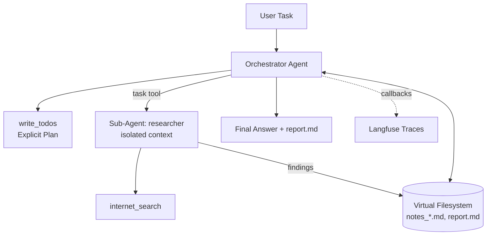

Chatbots answer one question at a time. Agents call tools in a loop. But give a classic tool-calling agent a task like *"research three inference engines and write me a comparative report"* and it falls apart: the context window overflows with tool outputs, the original goal drifts away, and one bad step derails everything with no recovery.

**Deep agents** solve this by adding four capabilities on top of the loop: explicit planning, a filesystem for working memory, sub-agent delegation with isolated context, and strong system prompts. This is the architecture behind tools like Claude Code and the "Deep Research" features you see in modern AI products.

In this blog, we'll build a deep agent step by step in Python using the `deepagents` library (built on LangGraph): first a shallow agent to see its limits, then a full deep agent with a research sub-agent, and finally we'll trace the whole thing with Langfuse from the [previous post of this series](https://ruslanmv.com/blog/Langfuse-Observability-for-LLM-Applications).

All the code is available in the companion repository: [github.com/ruslanmv/deep-agents-tutorial](https://github.com/ruslanmv/deep-agents-tutorial)

## Table of Contents

1. Introduction: Shallow vs Deep Agents
2. Setting Up the Environment
3. Building a Shallow Agent First
4. Building the Deep Agent
5. Running a Multi-Step Research Task
6. Observing the Agent with Langfuse
7. Architecture
8. Conclusion

---

## 1. Introduction: Shallow vs Deep Agents

A **shallow agent** runs a simple reactive loop: receive prompt → call model → execute tool → append result → repeat. Its entire state lives in the context window. This works beautifully for 3–10 step tasks and fails predictably beyond that:

- **Context overflow**: raw tool outputs pile up until the window is full.
- **Goal drift**: the high-level objective gets buried under procedural noise.
- **No recovery**: when a step fails, the agent has no plan to fall back on.

A **deep agent** externalizes what the shallow agent keeps in its head:

- **Explicit planning**: a todo list the agent writes, checks off and revises.
- **Virtual filesystem**: files as working memory — notes, drafts, intermediate results — instead of context.
- **Sub-agents**: focused workers with *isolated* context windows, receiving one task and returning one result.
- **Skills & prompts**: detailed operating instructions that keep behavior consistent over hundreds of steps.

The `deepagents` library packages all of this into a single factory function: `create_deep_agent()`.

Let's get into building this!

## 2. Setting Up the Environment

### Prerequisites

- **Python 3.11+**
- An **Anthropic API key** (default model) or OpenAI key
- A free **Tavily API key** for web search: [tavily.com](https://tavily.com)

1. **Create a Project Directory:**

```
mkdir deep-agents-tutorial
cd deep-agents-tutorial
```

2. **Create a Virtual Environment:**

```
python3 -m venv .venv
source .venv/bin/activate
```

3. **Install Dependencies:**

```
echo "deepagents langchain tavily-python langfuse python-dotenv" > requirements.txt
pip install -r requirements.txt
```

4. **Configure Credentials** in a `.env` file:

```
ANTHROPIC_API_KEY=sk-ant-...
TAVILY_API_KEY=tvly-...
```

---

## 3. Building a Shallow Agent First

To appreciate the deep agent, we first build the shallow one and watch where it struggles.

### Step 1: Define a Search Tool

Create `01_shallow_agent.py`:

```python
from dotenv import load_dotenv
load_dotenv()

import os
from tavily import TavilyClient
from langchain.agents import create_agent

tavily = TavilyClient(api_key=os.environ["TAVILY_API_KEY"])

def internet_search(query: str, max_results: int = 3) -> dict:
    """Run a web search and return results."""
    return tavily.search(query, max_results=max_results)
```

### Step 2: Create the Reactive Loop Agent

```python
agent = create_agent(
    model="anthropic:claude-sonnet-4-6",
    tools=[internet_search],
    system_prompt="You are a helpful research assistant.",
)

result = agent.invoke({
    "messages": [{"role": "user", "content": "What is PagedAttention in vLLM?"}]
})
print(result["messages"][-1].content)
```

Run it:

```
python 01_shallow_agent.py
```

you will get a correct, sourced answer. One question, one or two searches — the shallow loop is perfect for this.

Now ask it for a *multi-part comparative report with intermediate research on each part*, and you'll watch the context fill with raw JSON search results while the final answer gets thinner and loses parts of the original request. The loop has no plan and no scratchpad. This is the problem deep agents fix.

---

## 4. Building the Deep Agent

### Step 1: The Search Tool (Slightly Richer)

Create `02_deep_agent.py`:

```python
from dotenv import load_dotenv
load_dotenv()

import os
from typing import Literal
from tavily import TavilyClient
from deepagents import create_deep_agent

tavily = TavilyClient(api_key=os.environ["TAVILY_API_KEY"])

def internet_search(
    query: str,
    max_results: int = 5,
    topic: Literal["general", "news", "finance"] = "general",
) -> dict:
    """Run a web search."""
    return tavily.search(query, max_results=max_results, topic=topic)
```

### Step 2: Define a Research Sub-Agent

A sub-agent is declared as a simple dict. The orchestrator delegates via a built-in `task` tool; the sub-agent works in an **isolated context** and returns only its findings — the parent never sees the raw search noise:

```python
research_subagent = {
    "name": "researcher",
    "description": "Delegates focused research on a single sub-question.",
    "system_prompt": (
        "You are a focused researcher. Investigate exactly one question, "
        "search the web, and write your findings to a file."
    ),
    "tools": [internet_search],
}
```

### Step 3: Create the Deep Agent

```python
agent = create_deep_agent(
    model="anthropic:claude-sonnet-4-6",
    tools=[internet_search],
    system_prompt=(
        "You are an expert research agent. Plan your work with the todo tool, "
        "delegate sub-questions to the researcher sub-agent, save intermediate "
        "notes to files, and write the final answer to `report.md`."
    ),
    subagents=[research_subagent],
)
```

That single call wires up the whole harness. Out of the box the agent has: `write_todos` (planning), `ls`, `read_file`, `write_file`, `edit_file`, `glob`, `grep` (virtual filesystem), and `task` (sub-agent delegation) — plus your custom tools, which are merged in additively.

---

## 5. Running a Multi-Step Research Task

### Step 1: Invoke with a Long-Horizon Task

```python
result = agent.invoke({
    "messages": [{
        "role": "user",
        "content": (
            "Research the top 3 open-source LLM inference engines in 2026, "
            "compare their strengths, and write a short report to report.md."
        ),
    }]
})

print(result["messages"][-1].content)

# Inspect the virtual filesystem the agent used as working memory
for path, content in result.get("files", {}).items():
    print(f"\n===== {path} =====\n{content[:500]}")
```

### Step 2: Expected Output

Run it:

```
python 02_deep_agent.py
```

you will get output resembling:

```
I've completed the research and written the report to report.md.
Summary: vLLM leads in raw throughput (PagedAttention, continuous
batching), SGLang excels at structured generation and multi-turn
caching, and llama.cpp dominates local/edge deployment...

===== notes_vllm.md =====
## vLLM findings
- PagedAttention: block-based KV cache management...

===== report.md =====
# Open-Source LLM Inference Engines: 2026 Comparison
...
```

Watch what happened: the agent first wrote a **todo plan** (research vLLM → research SGLang → research llama.cpp → synthesize), delegated each sub-question to the `researcher` sub-agent, saved findings to **files** instead of stuffing them into context, and finally synthesized `report.md` from its own notes. The orchestrator's context stayed clean the entire time — that is the deep agent difference.

A word of honesty: deep agents multiply LLM calls (planning + sub-agents), so a run like this costs noticeably more than a single completion, and reliability on very long tasks is still an open problem. Keep humans in the loop for anything consequential.

---

## 6. Observing the Agent with Langfuse

The moment an agent runs autonomously, you *must* see inside it. Since `deepagents` is built on LangGraph, the Langfuse callback handler from the previous post traces everything with two lines.

Create `03_observed_agent.py` and add:

```python
from langfuse.langchain import CallbackHandler

handler = CallbackHandler()
result = agent.invoke(
    {"messages": [{"role": "user", "content": "Summarize what deep agents are in 3 bullets."}]},
    config={"callbacks": [handler]},
)
```

Open Langfuse and you will see one trace containing the full tree: every planning step, every `internet_search` call with its arguments, every sub-agent run as a nested span, every token spent. When your agent goes down a rabbit hole at 3 AM, this trace is how you find out why.

---

## 7. Architecture



- The **orchestrator** plans and coordinates, keeping its context minimal.
- **Sub-agents** absorb the messy work in isolated windows and return distilled results.
- The **filesystem** is persistent working memory shared between them.
- **Langfuse** watches everything from the outside.

## 8. Conclusion

In this tutorial, we built a deep agent from scratch: we saw why the shallow tool loop breaks on long tasks, assembled a deep agent with planning, a virtual filesystem and a research sub-agent using `create_deep_agent()`, ran a real multi-step research task, and traced the entire run with Langfuse.

You can experiment by:

- Adding a **second sub-agent** (e.g. a "critic" that reviews `report.md` before delivery).
- Switching the filesystem to a **persistent backend** so memory survives across runs.
- Using **human-in-the-loop interrupts** to approve tool calls before execution.

In the next post of this series, we go one layer down the stack: **serving the models themselves** with vLLM and the top inference methods of 2026.

**Congratulations!** You have created your own deep agent that plans, delegates and remembers. Happy coding!
