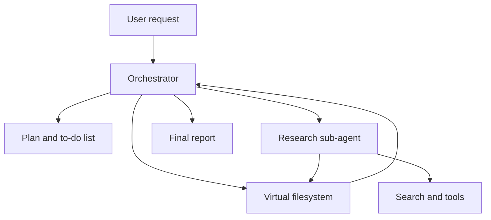

<div align="center">

# Deep Agents on Your Own GPU

### A hands-on lab for building local, tool-using agents with planning, files, and sub-agents

[](https://www.python.org/)
[](https://ollama.com/)
[](https://docs.astral.sh/uv/)
[](https://github.com/langchain-ai/deepagents)

**No model API key. No per-token bill. Your model, your GPU.**

[Read the article](https://ruslanmv.com/blog/Deep-Agents-on-Your-Own-GPU-A-Hands-On-Lab) · [Quick start](#quick-start) · [Explore the labs](#labs) · [Troubleshooting](#troubleshooting)

</div>


## Overview

This repository is the companion project for **“Deep Agents on Your Own GPU: A Hands-On Lab.”** It shows how to move beyond a basic ReAct loop and build a more capable local agent that can:

- create and maintain an explicit plan;
- write durable notes to a virtual filesystem;
- delegate focused work to isolated sub-agents;
- search, inspect, and edit files with built-in tools;
- stream progress and trace complete runs; and
- use the same local model directly through Ollama or through an OpenAI-compatible gateway.

The default setup uses [`qwen3:8b`](https://ollama.com/library/qwen3), served locally by Ollama. It is sized for a 12 GB NVIDIA GPU, but every lab can also run on CPU at a slower pace.

## Why deep agents?

A plain ReAct agent keeps the original request, reasoning, and every raw tool result in one growing conversation. On a long task, that context becomes noisy and can eventually be truncated without an obvious error.

A deep agent gives the same model a better working environment:

| Capability | Plain ReAct agent | Deep agent |
|---|---|---|
| Planning | Implicit in the conversation | Explicit to-do list |
| Working memory | One growing context | Notes stored as files |
| Delegation | None | Isolated sub-agent contexts |
| Long-task behavior | Tool output crowds out instructions | Orchestrator context stays focused |
| Reproducibility | Final response only | Notes, reports, traces, and tool history |

The key idea is simple: **one instruction goes into a sub-agent, one compact result comes back, and the noisy intermediate work stays isolated.**

## Architecture



The project separates three layers that are often confused:

1. **Model** — produces text and tool calls.
2. **Harness** — maintains the conversation, executes tools, and controls the loop.
3. **Deep-agent layer** — adds planning, files, sub-agents, and durable operating instructions.

## Quick start

### Prerequisites

- Python 3.11 or newer
- [`uv`](https://docs.astral.sh/uv/getting-started/installation/)
- [`Ollama`](https://ollama.com/download)
- A Tavily API key for the web-research labs
- Optional: Langfuse credentials for tracing

### Install and verify

```bash
git clone https://github.com/ruslanmv/deep-agents-tutorial.git
cd deep-agents-tutorial

make setup
make env
make model
make doctor
```

After `make env`, open `.env` and add your Tavily key. The remaining local-model settings already have sensible defaults.

Run the deep-agent lab:

```bash
make deep
```

Want the fastest demonstration with no API key and no network access?

```bash
make toolbox
```

Use `make help` to list every available command.

## Labs

| Command | Source | What it demonstrates |
|---|---|---|
| `make shallow` | `src/01_shallow_agent.py` | A plain ReAct tool loop and where it breaks |
| `make deep` | `src/02_deep_agent.py` | Planning, files, and a focused researcher sub-agent |
| `make toolbox` | `src/04_toolbox_agent.py` | Built-in file tools and delegation; no API key required |
| `make observed` | `src/03_observed_agent.py` | End-to-end tracing with Langfuse |
| `make ollabridge` | `src/05_ollabridge_demo.py` | The same model through an OpenAI-compatible gateway |
| `make advanced` | `src/06_advanced_agent.py` | Custom middleware and harness profiles; no API key required |

Supporting modules include:

| File | Purpose |
|---|---|
| `src/local_model.py` | Builds and configures the local model |
| `src/search.py` | Provides token-conscious web search |
| `src/progress.py` | Streams model and tool activity |
| `src/keys.py` | Validates optional hosted-service credentials |
| `src/00_doctor.py` | Runs hardware, model, and tool-calling checks |
| `Modelfile.example` | Bakes a context-window setting into a custom Ollama tag |

## Hardware guidance

The reference configuration is an **RTX 4080 Laptop GPU with 12 GB of VRAM**. The values below are starting points; `make doctor` checks the actual fit on your machine.

| GPU | VRAM | Suggested `DEEP_AGENT_NUM_CTX` |
|---|---:|---:|
| **RTX 4080 Laptop** | **12 GB** | **24576** |
| RTX 4080/5080 Desktop, RTX 5080/4090 Laptop | 16 GB | 32768 |
| RTX 4090 Desktop, RTX 5090 Laptop | 24 GB | 40960 |
| RTX 5090 Desktop | 32 GB | 40960 or a larger model |

No NVIDIA GPU is required. CPU execution works, but budget minutes per step instead of seconds and consider using `qwen3:4b`.

## Model selection

The default model is `qwen3:8b`, which offers a practical balance of tool-calling reliability and memory use.

```bash
make model MODEL=qwen3:14b
```

Then update `.env`:

```dotenv
DEEP_AGENT_MODEL=qwen3:14b
```

| Model | Approximate Q4 size | Recommended use |
|---|---:|---|
| `qwen3:4b` | 2.6 GB | Low-memory systems or CPU testing |
| **`qwen3:8b`** | **5.2 GB** | **Default; best fit for 12 GB VRAM** |
| `llama3.1:8b` | 4.9 GB | Alternative at a similar size |
| `qwen3:14b` | 9.3 GB | GPUs with 16 GB or more |
| `gpt-oss:20b` | 13 GB | GPUs with 24 GB or more |

Whatever model you choose must support tool calling. `make doctor` verifies this before you start a long run.

## Configuration that matters

Three settings in `src/local_model.py` are especially important for local deep agents:

| Setting | Why it matters |
|---|---|
| `num_ctx` | Controls the real Ollama context window; an undersized window can silently truncate earlier instructions |
| `profile={"max_input_tokens": num_ctx}` | Lets the harness compact context relative to the model's actual limit |
| `keep_alive` | Prevents Ollama from repeatedly unloading and reloading the model during a multi-call run |

Use one model instance for both the orchestrator and its sub-agents. Loading different models on one GPU can force Ollama to swap weights on every delegation.

## Built-in toolbox

`create_deep_agent()` exposes a useful default toolbox:

| Tool | Purpose |
|---|---|
| `write_todos` | Plan and track multi-step work |
| `ls` | Inspect the current directory |
| `glob` | Narrow files by name or path |
| `grep` | Find relevant files by literal content |
| `read_file` | Read only the files that matter |
| `write_file` | Save research notes and final output |
| `edit_file` | Apply focused edits |
| `delete` | Remove temporary files |
| `task` | Delegate isolated work to a sub-agent |
| `execute` | Run shell commands when the backend supports it |

A practical file-analysis pattern is:

```text
glob → grep → read_file
```

Narrow by filename, narrow by content, and only then read the remaining files. This keeps limited local context windows focused.

## Example run

On the reference RTX 4080 Laptop GPU, `qwen3:8b` with a 24,576-token context completed the deep-agent lab in approximately 49 seconds:

```text
write_todos
task          # focused research sub-agent
task          # focused research sub-agent
task          # focused research sub-agent
read_file
write_file
```

The orchestrator completed the job in six tool-calling turns while the detailed search work remained inside the delegated contexts. Small local models can still miss requested filenames or skip steps, so inspect the generated report and supporting notes rather than assuming perfect instruction following.

## Observability

Run the traced example with:

```bash
make observed
```

This records the model calls, tool calls, delegation boundaries, and timing data in Langfuse. Tracing is optional for the other labs but particularly useful when a long agent run appears to drift or stall.

## OllaBridge gateway

[OllaBridge](https://github.com/ruslanmv/ollabridge) exposes local Ollama models and other backends through one OpenAI-compatible endpoint.

```bash
pip install ollabridge
ollabridge start --auth-mode local-trust --host 127.0.0.1
```

In another terminal:

```bash
make ollabridge
```

The lab checks both chat and tool calling before running a real deep agent. If you use a remote or authenticated gateway, configure `OLLABRIDGE_URL` and `OLLABRIDGE_API_KEY` in `.env`.

## Troubleshooting

Start with:

```bash
make doctor
```

It checks the GPU, Ollama daemon, installed model, context window, estimated VRAM use, tool calling, actual GPU placement, and deep-agent harness.

| Symptom | Likely cause | Recommended action |
|---|---|---|
| Model answers in prose instead of calling a tool | Model lacks reliable tool-call support | Use `qwen3:8b` or another tool-capable model |
| Run is unexpectedly slow | Part of the model spilled to CPU | Lower `DEEP_AGENT_NUM_CTX` or select a smaller model |
| Long pause on a `task` call | A complete sub-agent is running inside that call | Wait; this is normal unless progress stops for several minutes |
| Agent forgets early instructions | Context window is too small or compaction is misconfigured | Check `num_ctx` and the model profile |
| `write_todos` is unavailable | `TodoListMiddleware` was not registered | Keep `middleware=[TodoListMiddleware()]` |
| `execute` fails with `StateBackend` | That backend does not provide a shell sandbox | Use file tools or a sandbox-capable backend |
| `glob` raises a `modified_at` error | Seeded files are missing complete metadata | Build seeded values with `create_file_data()` |

For additional cases, see [`TROUBLESHOOTING.md`](TROUBLESHOOTING.md).

## Project structure

```text
.
├── src/
│   ├── 00_doctor.py
│   ├── 01_shallow_agent.py
│   ├── 02_deep_agent.py
│   ├── 03_observed_agent.py
│   ├── 04_toolbox_agent.py
│   ├── 05_ollabridge_demo.py
│   ├── 06_advanced_agent.py
│   ├── local_model.py
│   ├── progress.py
│   └── search.py
├── assets/images/posts/2026-08-23-Deep-Agents-Ollama/
├── .env.example
├── Makefile
├── Modelfile.example
├── pyproject.toml
└── uv.lock
```

## Further reading

- [Deep Agents](https://github.com/langchain-ai/deepagents)
- [Ollama](https://ollama.com/)
- [LangChain](https://github.com/langchain-ai/langchain)
- [Langfuse](https://langfuse.com/)
- [Tavily](https://tavily.com/)
- [OllaBridge](https://github.com/ruslanmv/ollabridge)

---

Created by [Ruslan Magana Vsevolodovna](https://ruslanmv.com). If this lab helps you, consider starring the repository and sharing what you build.
